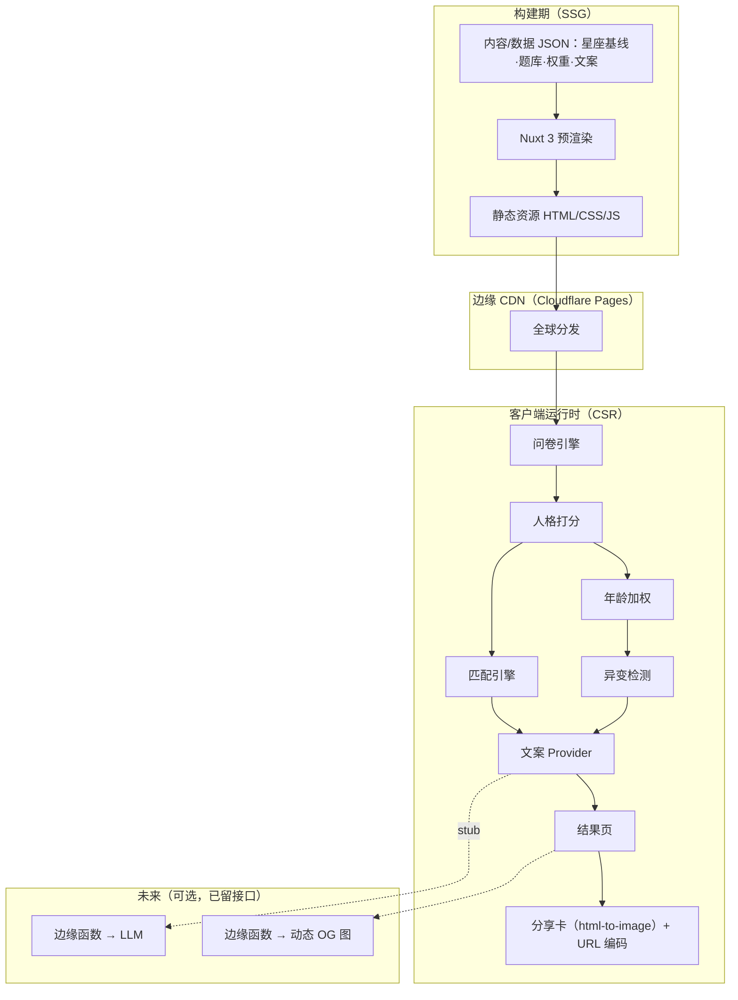

# 星座百科 · 技术设计文档

| 项 | 内容 |
|---|---|
| 项目名称 | 星座百科（Astro Persona） |
| 文档版本 | v1.0（草案） |
| 编写日期 | 2026-06-26 |
| 配套文档 | 《系统需求文档 SRS》 |
| 架构基调 | Jamstack：SSG 优先 + 客户端纯函数运算 + 预留边缘函数 |

---

## 1. 架构概览

### 1.1 架构风格与取舍
站点几乎不存在"每请求都要服务端动态渲染"的内容，因此采用 **SSG 为主、客户端运算为辅** 的混合方案，而非整站 SSR：

- **内容页（12 星座 / 落地页）** → 构建期预渲染（SSG），CDN 直出，吃满 SEO 与速度。
- **测试 / 异变 / 匹配** → 浏览器端纯函数运算（CSR），无密钥、无数据库依赖。
- **未来的动态能力（动态 OG 图、LLM 文案）** → 按需边缘函数，不影响主站静态性。

这套选型同时满足"不占用太多资源"和"免费部署"两个硬约束。

### 1.2 架构分层



### 1.3 渲染策略边界

| 路由/模块 | 渲染 | 说明 |
|---|---|---|
| `/`、`/zh`、`/en` 落地页 | SSG | SEO + 速度 |
| `/[locale]/signs/[sign]` 星座详情 | SSG | 每星座独立可索引 |
| `/[locale]/test` 测试 | SSG 外壳 + CSR 逻辑 | 题库静态、运算在端 |
| `/[locale]/result` 结果 | CSR（读 URL 状态） | 可分享复现 |
| `/[locale]/match` 匹配 | CSR | 依赖人格向量 |
| 动态 OG 图、LLM 文案 | （未来）边缘函数 | 本期不实现 |

---

## 2. 技术栈

| 层 | 选型 | 理由 |
|---|---|---|
| 框架 | **Nuxt 3** | Vue 技术栈零迁移成本；`nitro` 支持 prerender / 混合渲染 / 后续边缘部署 |
| 语言 | **TypeScript** | 算法纯函数 + 数据 Schema 强约束 |
| 国际化 | **@nuxtjs/i18n** | 路由级多语言、hreflang、惰性加载语言包 |
| 状态 | **Pinia**（+ composables） | 测试/匹配会话状态集中、可测 |
| 样式 | **UnoCSS**（或 Tailwind） | 原子化、体积可控；契合设计令牌系统 |
| 可视化 | **自绘 SVG**（六维能量罗盘/雷达） | 签名视觉，可控、可进分享卡 |
| 分享卡 | **modern-screenshot / html-to-image** | 纯客户端把 DOM 转 PNG，无需服务器 |
| 测试 | **Vitest** | 对算法纯函数做单测与回归 |
| 构建/部署 | **Cloudflare Pages** | 免费、全球 CDN、自带 Functions 承接未来动态需求 |

---

## 3. 项目结构（建议）

```
astro-persona/
├─ content/                 # 版本化内容与配置（非工程可改）
│  ├─ signs/{zh,en}.json     # 12 星座双语描述 + 基线向量
│  ├─ questions/{zh,en}.json # 题库（题面/选项/维度权重）
│  ├─ copy/{zh,en}.json      # 关键词/原型名/异变激励语/匹配解释模板
│  └─ config/
│     ├─ weights.json         # 匹配权重、年龄→α、异变阈值参数
│     └─ compat-matrix.json   # 12×12 元素基础相性
├─ src/
│  ├─ core/                  # 纯函数算法（无框架依赖，可单测）
│  │  ├─ personality.ts       # AR-1 打分
│  │  ├─ age.ts               # AR-2 年龄加权
│  │  ├─ mutation.ts          # AR-3 异变
│  │  ├─ matching.ts          # AR-4 匹配
│  │  └─ types.ts             # 共享类型/Schema
│  ├─ narrative/             # 文案 Provider（接口 + 模板实现 + LLM stub）
│  │  ├─ provider.ts          # NarrativeProvider 接口
│  │  ├─ template.provider.ts # 本期启用：规则/模板
│  │  └─ llm.provider.ts      # 预留 stub（未来走边缘函数）
│  ├─ composables/           # useTestSession / useMatch / useShareCard …
│  ├─ components/            # EnergyCompass(罗盘) / QuestionCard / ResultCard …
│  └─ pages/                 # Nuxt 路由（含 [locale]）
└─ tests/                    # Vitest 单测：算法 + 校准
```

---

## 4. 数据模型与 Schema（TypeScript）

```ts
// 六维人格向量：四象能量 + 两条极性轴，均归一化到 [0,1]
export interface PersonalityVector {
  fire: number;   // 行动/热情/外驱
  earth: number;  // 务实/秩序/稳定
  air: number;    // 思辨/社交/求新
  water: number;  // 情感/直觉/共情
  expr: number;   // 极性轴：内显(0)↔外显(1)
  order: number;  // 极性轴：混沌(0)↔守序(1)
}
export type Dim = keyof PersonalityVector;

export type Element = 'fire' | 'earth' | 'air' | 'water';
export type Modality = 'cardinal' | 'fixed' | 'mutable'; // 三态：启动/固定/变动

export interface SignProfile {
  id: string;                  // 'aries' …
  element: Element;
  modality: Modality;
  baseline: PersonalityVector; // 共识基线（提炼自多家来源）
  // 双语展示内容在 content/signs/{locale}.json 中按 id 对齐
}

export interface QuestionOption {
  id: string;
  weights: Partial<Record<Dim, number>>; // 该选项对各维度的加权
}
export interface Question {
  id: string;
  options: QuestionOption[]; // 题面/选项文案在 i18n 资源中按 id 取
}

export interface MatchWeights { w1: number; w2: number; w3: number; } // 基础/人格/理想型
export interface Config {
  age: { breakpoints: { maxAge: number; alpha: number }[] };
  mutation: { tauBase: number; beta: number; levels: number[] };
  match: { base: MatchWeights; mutationMultiplier: number };
}

// 结果状态：编码进 URL 以实现可分享复现（紧凑、无 PII）
export interface ResultState {
  v: PersonalityVector;  // 用户向量
  sign: string;          // 用户太阳星座
  ageBand: number;       // 年龄段索引（非精确生日）
  mutated?: { level: number; dims: Dim[] };
  ideal?: PersonalityVector; // 可选理想型
}
```

---

## 5. 核心算法实现

> 所有函数为**纯函数**，集中在 `src/core/`，参数全部来自 `content/config/`，便于调参与单测。下列默认参数为初值，需经数据校准后定稿。

### 5.1 人格打分（AR-1）
```
对每个维度 d：
  raw[d] = Σ_i ( 选中选项i.weights[d] )         // 累加各题权重
  v[d]   = normalize(raw[d])                     // 按该维度的理论极值归一化到 [0,1]
返回 V_user = { fire, earth, air, water, expr, order }
```
- 归一化用各维度的"理论最大可得分"做分母，保证跨维可比。
- 关键词与原型名：取 `V_user` 的 **Top-2 主导维 + 1 个缺失维**，在文案库中查表组合（如 火↑风↑水↓ → 原型"炽焰先锋"）。**不输出四字母代码**。

### 5.2 年龄加权（AR-2）
```
α(ageBand): 分段查表，年龄越大 α 越大（星座信号越弱）
  默认：<18→0.10, 18–25→0.20, 26–35→0.35, 36–45→0.50, 46+→0.65

有效基线：
  B_eff[d] = (1 − α) · B_sign[d] + α · B_neutral[d]
  其中 B_neutral = 全星座基线的平均向量（"中性个体画像"）
```

### 5.3 异变检测（AR-3）
```
偏离度（归一化欧氏距离，∈ [0,1]）：
  D = sqrt( Σ_d (V_user[d] − B_eff[d])^2 ) / sqrt(6)

年龄相关阈值（年龄越大阈值越低，越易异变）：
  τ(age) = tauBase − beta · α(age)      // 默认 tauBase=0.40, beta=0.15

判定：
  isMutated = D > τ
  level     = 落入 [τ, τ+0.1) → 微异 ; [τ+0.1, τ+0.2) → 显异 ; ≥ τ+0.2 → 极异
  drivers   = |V_user[d] − B_eff[d]| 最大的若干维度（用于"可解释"展示）
```
- **校准**：用合成/真实样本分布调 `tauBase`、`beta`，使整体异变率落在 15%–30%（SRS FR-4.4）。
- 余弦距离 `1 − cos(V_user, B_eff)` 可作为备选度量，二者择一并固定。

### 5.4 匹配评分（AR-4）
```
基础层（传统元素相性，查 12×12 矩阵）：
  base(A,B)：同元素=0.85；互补元素(火-风/土-水)=0.75；六分相=0.70；
            对宫(180°)=0.60；刑克(90°)=0.45；其余≈0.55（再叠加每星座微调）

人格补充因子（相似 + 互补）：
  sim_d  = 1 − |V_user[d] − P_B[d]|                 // 越接近越高
  comp_d = 1 − |V_user[d] + P_B[d] − 1|             // 越互补越高（一高一低）
  similarity     = mean(sim_d  over 对齐维: earth, water, order)   // 价值观/生活方式宜相似
  complement     = mean(comp_d over 平衡维: fire, water, expr)     // 能量宜互补
  personality(B) = w_sim · similarity + w_comp · complement        // 默认 w_sim=w_comp=0.5

理想型因子（仅当用户填写理想型时启用）：
  ideal(B) = cosine( V_ideal , P_B )

最终得分：
  score(B) = w1·base(userSign,B) + w2·personality(B) + w3·ideal(B)
  默认权重：有理想型 → (w1,w2,w3)=(0.5,0.3,0.2)
            无理想型 → (w1,w2,w3)=(0.6,0.4,0)，并重归一

异变联动（用户本人异变时）：
  w1 ← w1 · mutationMultiplier(默认0.6)，削减的权重并入 w2 后整体重归一
  （星座已不代表该用户 → 弱化元素、强化真实人格）

输出：score 降序取 Top-N，每条附解释（元素关系 + 命中的相似/互补维 + 理想型契合度）
```

---

## 6. 国际化设计（中英）

- **路由策略**：`@nuxtjs/i18n` 采用 `prefix` 策略，`/zh/...` 与 `/en/...` 各自独立、各自可索引。
- **语言探测**：首访按 `Accept-Language` 预选，用户可手动切换并写入本地偏好（非 PII）。
- **SEO**：每页输出 `hreflang`（zh / en / x-default）互链；`og:locale` 随语言变化。
- **内容组织**：所有展示文案外置于 `content/**/{zh,en}.json`，按稳定 `id` 对齐；算法只认 `id`，与语言无关。
- **质量**：异变激励语、原型名等"有情绪"的文案要**两种语言各自打磨**，不做机翻直译。

---

## 7. 增长与分享机制

- **可分享卡片**：结果页内置一个离屏卡片组件（含能量罗盘、原型名、关键词、品牌水印），用 `modern-screenshot/html-to-image` 在客户端渲染为 PNG。
- **分发**：优先 Web Share API（移动端原生分享面板），桌面端退化为下载 + 复制链接。
- **状态可复现**：`ResultState` 经紧凑序列化 + base64url 编码进 URL（如 `/en/result?s=...`），他人打开即复现同一结果与语言。
- **二次传播**："测一测你和 TA"对比入口，把分享者的结果作为对比锚点引流新用户。
- **社交预览（OG）**：本期用**静态默认 OG 图**；"按结果动态生成 OG 图"需边缘函数渲染，列入未来项（见第 8、14 节）。

---

## 8. LLM 增强接口设计（预留，不实现）

文案生成统一收口到一个 Provider 接口；本期只启用模板实现，未来可无缝替换为边缘函数 + LLM。

```ts
export interface NarrativeContext {
  locale: 'zh' | 'en';
  vector: PersonalityVector;
  sign: string;
  mutation?: { level: number; dims: Dim[] };
  match?: { sign: string; reasons: string[] }[];
}

export interface NarrativeProvider {
  personalityCopy(ctx: NarrativeContext): Promise<string>;
  mutationCopy(ctx: NarrativeContext): Promise<string>;
  matchCopy(ctx: NarrativeContext): Promise<string>;
}

// 本期唯一启用：纯模板/规则，离线、免费、确定性强
export class TemplateNarrativeProvider implements NarrativeProvider { /* 查文案库拼装 */ }

// 预留 stub：未来经边缘函数调用大模型（密钥藏服务端 + 缓存 + 失败降级到模板）
export class LLMNarrativeProvider implements NarrativeProvider {
  constructor(private fallback: NarrativeProvider) {}
  async personalityCopy(ctx) {
    // 未来：fetch('/api/narrative', {…})；本期直接降级
    return this.fallback.personalityCopy(ctx);
  }
  // mutationCopy / matchCopy 同理
}

// 工厂：通过一个开关切换实现，业务调用方代码零改动
export const narrative: NarrativeProvider =
  import.meta.env.VITE_USE_LLM === 'true'
    ? new LLMNarrativeProvider(new TemplateNarrativeProvider())
    : new TemplateNarrativeProvider();
```
**契约要点**：方法签名稳定；LLM 实现必须带**缓存**（同输入同输出、控成本）与**降级**（失败回退模板）；密钥永不进前端。

---

## 9. 状态管理与数据流
- 一次测试会话（答案 → 向量 → 异变 → 结果）由 `useTestSession` 持有；匹配由 `useMatch` 持有，依赖前者产出的向量。
- 结果进入结果页前序列化为 `ResultState` 写入 URL；刷新/分享均从 URL 还原，**会话不依赖任何后端**。

---

## 10. 部署与 CI/CD（Cloudflare Pages 为主）
- **构建**：`nuxt generate`（或带 route rules 的混合预渲染）产出静态产物。
- **托管**：Cloudflare Pages 连接 Git 仓库，推送自动构建；PR 自动生成预览部署。
- **未来动态能力**：用 Pages Functions / Workers 承接动态 OG 与 LLM 代理，不改主站静态性。
- **环境变量**：`VITE_USE_LLM` 等开关；任何密钥只配置在边缘函数侧。
- **备选托管**：Vercel（Hobby）/ Netlify 同样适配；GitHub Pages 适合 100% 纯静态形态。
- 注：各家免费额度条款会变，落地前以官网当前条款为准。

---

## 11. 性能与 SEO 策略
- 内容页 SSG + CDN；测试 JS 路由级懒加载；题库/矩阵按需加载、分块。
- 罗盘用 SVG，避免重型图表库；分享卡按需实例化离屏组件。
- 结构化数据 + 语义化标签 + hreflang；目标 Lighthouse Performance/SEO ≥ 90。

## 12. 可测试性
- `src/core/*` 全为纯函数：对打分、年龄加权、异变判定、匹配评分做单测与边界用例。
- 维护一组**校准用例**（固定输入 → 期望异变率/排序），调参后回归，防止权重漂移。

## 13. 安全与隐私
- 纯静态无后端攻击面；不收集 PII（仅年龄段）；本地偏好非敏感。
- 分析若启用，采用隐私友好方案 + 同意横幅，满足 GDPR/CCPA 最低披露。
- 未来边缘函数：隐藏密钥、限流、缓存、最小权限。

## 14. 未来扩展路线
1. 边缘函数：按结果**动态生成 OG 分享图**（提升社交点击率）。
2. 启用 **LLM 文案** Provider（边缘代理 + 缓存 + 降级）。
3. 进阶玩法：引入月亮/金星/上升等**真实合盘**（需采集出生时间，权衡隐私）。
4. 再扩语言；隐私友好的传播漏斗分析与 A/B 调参。
